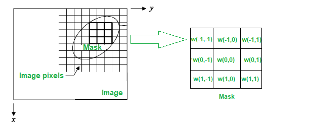

# Filtragem Espacial

Ao contrário das funções de transformação de intensidade básicas, em que o pixel da imagem de saída dependia exclusivamente do pixel correspondente na imagem de entrada, a filtragem especial considera também os pixels vizinhos no processamento do pixel de saída.

Sendo assim, o processo de filtragem consiste de uma vizinhança e valores de uma máscara que definem a operação que será aplicada sobre os pixels de entrada.

A filtragem cria um novo pixel com coordenadas iguais ao do centro de vizinhança e cujo valor é o resultado da operação de filtragem determinada pela máscara. Assim, esse processo se repete para cada pixel da imagem de entrada, em que, ao mover o ponto central, novas vizinhanças são criadas.

    

## Definições importantes

* Geralmente, as máscaras aplicadas são quadradas (largura e altura iguais).

* As máscaras possuem dimensões de tamanho ímpar (garantir que haja um ponto central).

    &nbsp;&nbsp;&nbsp;&nbsp; Considerando uma máscara de tamanho $m \ x \ n$, $m$ e $n$ podem ser definidos da seguinte forma:

    &nbsp;&nbsp;&nbsp;&nbsp; $m = 2a + 1$

    &nbsp;&nbsp;&nbsp;&nbsp; $n = 2b + 1$

    &nbsp;&nbsp;&nbsp;&nbsp; , onde a e b são inteiros positivos.

    &nbsp;&nbsp;&nbsp;&nbsp; Sendo assim, a menor vizinhança/máscara possível é de tamanho $3 \ x \ 3$.

* A imagem de saída, $g(x, y)$, pode ser definida da seguinte forma, considerando $f(x, y)$ a imagem de entrada e $w$ uma máscara qualquer de tamanho $3 x 3$:
    
    &nbsp;&nbsp;&nbsp;&nbsp; $g(x, y) = w(-1, -1)f(x - 1, y - 1) +$ ... $w(0, 0)f(x, y) +$ ... $w(1, 1)f(x + 1, y + 1)$

* Assim, pode-se definir a filtragem especial de uma imagem $f$ de tamanho $M \ x \ N$ com uma máscara de dimensões $m \ x \ n$, pela expressão genérica:

    &nbsp;&nbsp;&nbsp;&nbsp; $g(x, y) = \sum\limits _{s=-a}^{a} \ \sum\limits _{t=-b}^{b} \ w(s, t)f(x + s, y + t)$

* Quando a máscara se aproxima das bordas de uma imagem, há o problema de algumas posições da máscara não possuírem pixels correspondentes para realizar a operação de filtragem. Nesse caso, existem 3 possibilidades para contornar isso, sendo a última delas a mais viável:

    1. Não processar a borda (ou seja, ignorar os pixels em que a operação não pode ser realizada).
    1. Filtrar os pixels somente com as posições da máscara que estão contidas na imagem, o que aumenta demasiadamente a complexidade da operação.
    1. Expandir a imagem criando $m - 1$ linhas  e $n - 1$ colunas adicionais.
        * As novas linhas e colunas podem ser preenchidas com um determinado valor fixo.
        * Ou então, preenchidas por replicação, copiando os pixels da borda correspondente.

* O processo de filtragem descrito acima, onde a máscara se move sobre cada pixel da imagem de entrada e define o valor do pixel de saída correspondente, é chamado de convolução. Porém, há um processo semelhante, mas que envolve o rotacionamento em $180^o$ da máscara definida, chamado de correlação.

    &nbsp;&nbsp;&nbsp;&nbsp; $g(x, y) = \sum\limits _{s=-a}^{a} \ \sum\limits _{t=-b}^{b} \ w(s, t)f(x - s, y - t)$

    &nbsp;&nbsp;&nbsp;&nbsp; Utilizando máscaras simétricas, o resultado obtido é o mesmo.

## Tópicos Relacionados

* [**Filtros Espaciais de Suavização**](filtroSuavizacao)
* [**Filtros Espaciais de Realce para Arestas**]()
* [**Combinando Métodos de Realce Espacial**]()