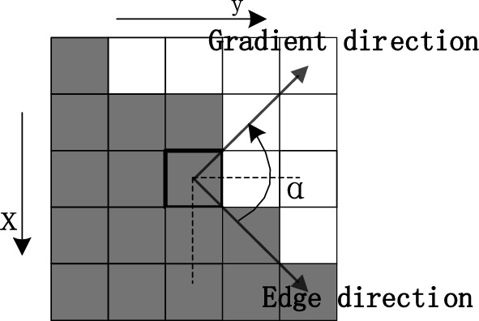

# Filtro Gradiente

Também chamado de Filtro de Sobel, é baseado no cálculo da primeira derivada.

## Definição Matemática

O cálculo envolve, mais especificamente,a magnitude do vetor gradiente.

$\nabla f = \frac{\partial f}{\partial x} + \frac{\partial f}{\partial y}$

A magnitude do vetor gradiente pode ser calculado da seguinte forma:

$|\nabla f| = \sqrt{G_x^2 + G_y^2}$

Porém, por ser muito caro computacionalmente calcular a todo momento a raiz quadrada, esse valor pode ser aproximado pela soma dos módulos das derivadas parciais de primeira ordem, sem perdas significantes de representação:

$|\nabla f| \approx |G_x| + |G_y|$

    

Vale ressaltar a importância do vetor gradiente para a análise do comportamento da função.

No caso específico de uma função bidimensional, como uma imagem, o gráfico gerado pela mesma se trata de uma superfície contida no $R^3$, visto que para cada valor $(x, y)$ contido no domínio $R^2$ está associado um valor $f(x, y)$ contido em $R$.

Assim, ao definirmos as derivadas parcias de $f$, é possível determinar o plano tangente à superfície, que contém as derivadas direcionais de f em qualquer direção $\vec{u}$. 

O vetor gradiente, que tem como componentes $x$ e $y$ justamente as derivadas parciais, possui a propriedade de apontar na direção da maior taxa de descontinuidade de $f$ em uma determinada posição $(x, y)$. Além disso, quanto maior a descontinuidade maior a magnitude do vetor gradiente.

Sendo assim, as derivadas parciais de primeira ordem podem ser definidas da seguinte forma:

$G_x = f(x + 1, y - 1) + 2f(x + 1, y) + f(x + 1, y + 1) - [f(x - 1, y - 1) + 2f(x - 1, y) + f(x - 1, y + 1)]$

$G_y = f(x - 1, y + 1) + 2f(x, y + 1) + f(x + 1, y + 1) - [f(x - 1, y - 1) + 2f(x, y - 1) + f(x + 1, y - 1)]$

O que resulta em duas máscaras, chamadas de **Operadores de Sobel**, uma para detecção de bordas verticais ($G_x$) e outra para a detecção de bordas horizontais (G_y):

| $-1$ | $-2$ | $-1$ |
|:---:|:---:|:---:|
| $0$ | $0$ | $0$ |
| $1$ | $2$ | $1$ |

| $-1$ | $0$ | $1$ |
|:---:|:---:|:---:|
| $-2$ | $0$ | $2$ |
| $-1$ | $0$ | $1$ |
