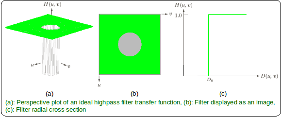

# Filtro Passa-Alta

Em contraste com os filtros passa-baixa, os filtro passa-alta tendem a dar ênfase as bordas/arestas e, eventualmente, aos ruídos presentes na imagem. Isso ocorre por meio da atenuação e/ou bloqueio das baixas frequências, enquanto permite a passagem das altas frequências.

Os filtros passa-alta são obtidos a partir da definição do filtro de passa-baixa correspondente:

$H_{HP}(u, v) = 1 - H_{LP}(u, v)$

## Filtro Passa-Alta Ideal

$H(u, v) = 0, se D(u, v) \le D_{o}$

$H(u, v) = 1, se D(u, v) > D_{o}$

onde $D(u, v)$ é a distância euclidiana entre a coordenada $(u, v)$ e o centro da transformada de dimensões $P x Q$ pode ser calculado por:

$D(u, v) = \sqrt{{(u - \frac{P}{2})}^{2} + {(v - \frac{Q}{2})}^{2}}$

    

## Filtro Passa-Alta Butterworth

De forma similar ao Filtro Passa-Baixa Butterworth, funciona como um intermediário ao Filtro Passa-Alta Ideal e Gaussiano e, a depender da ordem utilizada, pode se aproximar mais ou menos de algum deles. Para valores altos de $n$, o filtro BHPF se aproxima do Filtro Passa-Alta Ideal, enquanto que, para valores baixos de $n$, se aproxima do Filtro Passa-Alta Gaussiano.

$H(u, v) = \frac{1}{1 + {[\frac{D_o}{D(u, v)}]}^{2n}}$

    

## Filtro Passa-Alta Gaussiano

$H(u, v) = 1 - e^{\frac{-{D(u, v)}^{2}}{2{D_o}^{2}}}$

    

