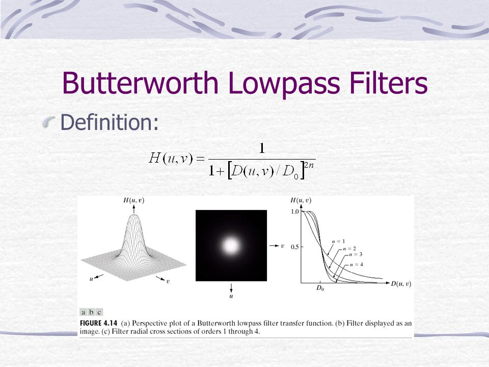

# Filtro Passa-Baixa Butterworth

Além de ser parametrizado pelo valor $D_{o}$, o Filtro de Passa-Baixa Butterworth utiliza uma varível $n$, chamada de ordem do filtro.

Definido por:

$H(u, v) = \frac{1}{1 + {[\frac{D(u, v)}{D_o}]}^{2n}}$

    

Para valores altos de $n$, o filtro BLPF se aproxima do Filtro Passa-Baixa Ideal, enquanto que, para valores baixos de $n$, se aproxima do Filtro Passa-Baixa Gaussiano. De qualquer forma, ele não possui descontinuidade abrupta entre as frequências passantes e filtradas.