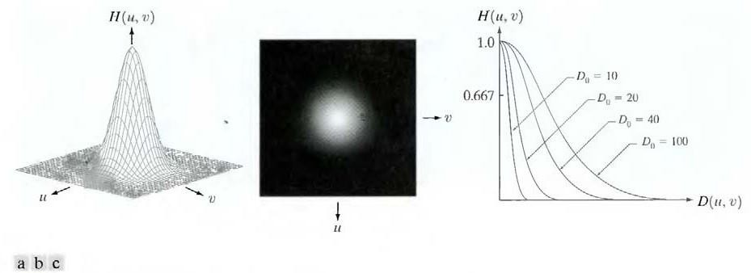

# Filtro Passa-Baixa Gaussiano

Os valores utilizados no filtro seguem uma distribuição normal, ou gaussiana, e, portanto, é parametrizado pelo desvio padrão utilizado. O desvio padrão utilizado pode ser associado a frequência de corte $D_{o}$.

$H(u, v) = e^{\frac{-{D(u, v)}^{2}}{2{D_o}^{2}}}$

    

De forma grosseira, pode-se dizer que a partir de 3 desvios padrões a probabilidade de uma variável que segue uma distribuição gaussiana é nula. Ou seja, quanto maior o desvio padrão utilizado, maior o achatamento da curva de distribuição e, portanto, menor o efeito de suavização. 