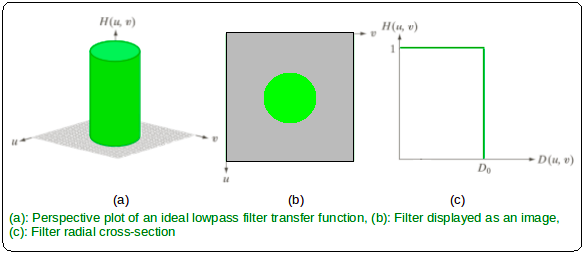

# Filtro Passa-Baixa Ideal

Filtro que passa sem atenuação todas as frequências localizadas dentro de círculo centrado na origem e elimina as demais frequências. A intensidade desse filtro é parametrizada pelo valor da constante $D_{o}$ que define o raio desse círculo. Ou seja, o valor de $D_{o}$ é inversamente proporcional ao efeito de suavização.

Especificado pela função definida por partes:

$H(u, v) = 1, se D(u, v) \le D_{o}$
$H(u, v) = 0, se D(u, v) > D_{o}$

onde $D(u, v)$ é a distância euclidiana entre a coordenada $(u, v)$ e o centro da transformada de dimensões $P x Q$ pode ser calculado por:

$D(u, v) = \sqrt{{(u - \frac{P}{2})}^{2} + {(v - \frac{Q}{2})}^{2}}$

    

Por ser muito abrupto, o filtro de passa-baixa ideal costuma produzir oscilações indesejadas na imagem de saída.