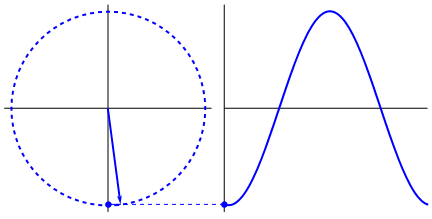
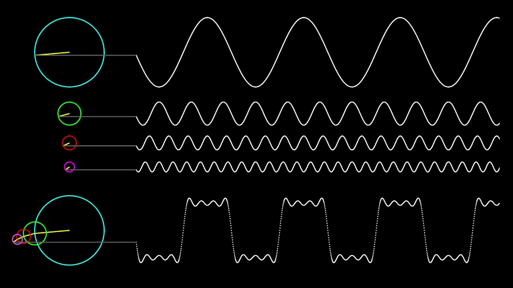
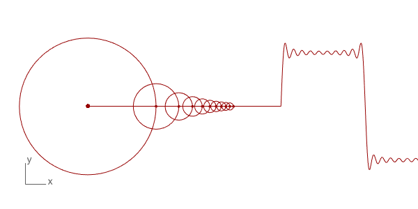
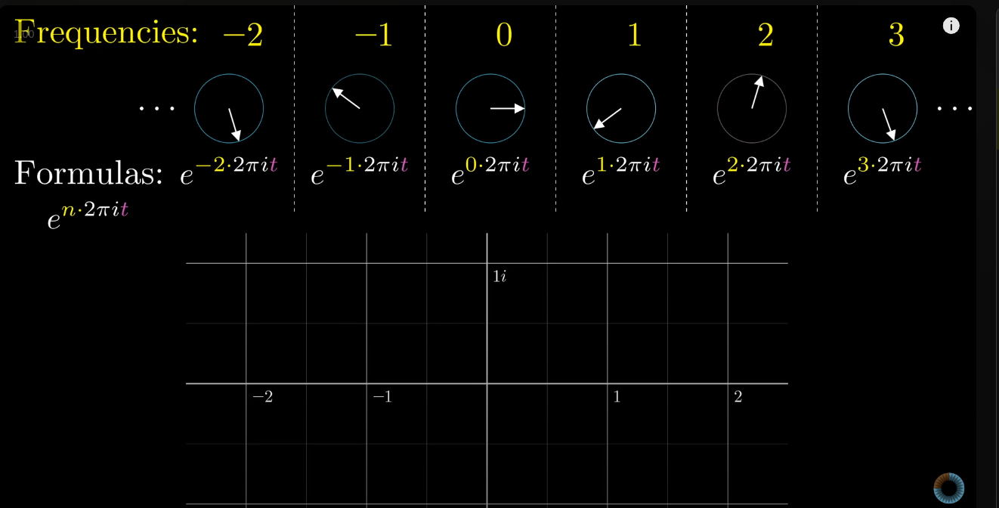
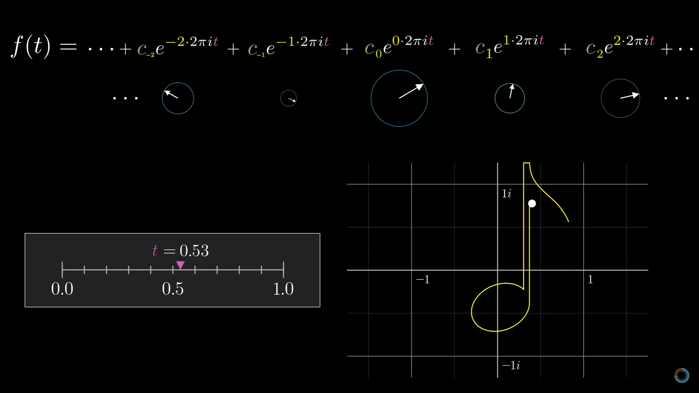
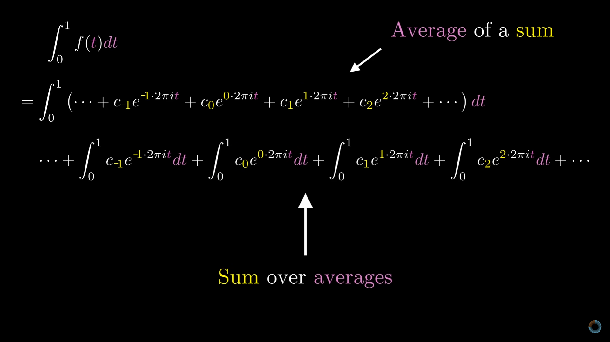

# Transformada de Fourier

## Referências

* [Fourier Transforms || Theoretical Interpretations, Complex Exponentials and Window Effect](https://www.youtube.com/watch?v=3qnFjeqPFX4)
* [But what is a Fourier series? From heat flow to drawing with circles | DE4](https://www.youtube.com/watch?v=r6sGWTCMz2k)
* [But what is the Fourier Transform? A visual introduction.](https://www.youtube.com/watch?v=spUNpyF58BY)
* [The Remarkable Story Behind The Most Important Algorithm Of All Time](https://www.youtube.com/watch?v=nmgFG7PUHfo)
* [The Fourier Series and Fourier Transform Demystified](https://www.youtube.com/watch?v=mgXSevZmjPc)

## Série de Fourier

Se a posição vertical de um ponto na extremidade de um círculo girando com uma frequência constante fosse traçado ao longo do tempo, o resultado obtido é uma onda senoidal com frequência igual à do movimento circular da partícula e amplitude igual ao raio da circunferência.

O mesmo vale para ondas cossenoidais, que podem ser entendidas como ondas seno deslocadas $\frac{\pi}{2}$ radianos no eixo horizontal.

    

A **Série de Fourier** determina que qualquer função periódica pode ser descrita como a soma de diversas funções seno e cosseno. Assim, um determinado sinal periódico pode ser decomposto nas frequências puras que formam esse sinal.

Entende-se por função periódica, com um determinado período $T$, qualquer função que a seguinte condição, para qualquer $t$, seja satisfeita:

$f(t + T) = f(t)$

    
    

Sendo assim, a Série de Fourier nos permite identificar quais ondas formam um sinal, e nesse caso me refiro a frequência dessas ondas, e o quanto cada uma delas contribuem para a composição do mesmo, nesse caso determinado pelas suas amplitudes.

### Plano Complexo

Os vetores rotativos mostrados acima podem ser descritos como coordenadas no plano complexo e estão intimamente relacionados com as funções seno e cosseno.

Um número complexo $z$ pode ser escrito na forma: $z = x + iy$. No qual x é sua parte real, y a parte imaginária e $i = \sqrt{-1}$ a unidade imaginária.

No plano complexo, o eixo horizontal representa a parte real e o eixo vertical a parte imaginária de um determinado número, assim, o número complexo  $z = x + iy$ pode ser representado como um vetor a partir da origem até o ponto $(x,y)$.

Além disso, um número complexo pode ser definido por meio de suas coordenadas polares:

$z = r(cos\theta + isen\theta)$

$z = re^{i\theta}$

ou então, $z = e^{i\theta}$, para um círculo unitário,

tendo em vista a fórmula de Euler: $e^{i\theta} = cos\theta + isen\theta$.

Logo, considerando um círculo unitário, $cos\theta$ e $isen\theta$ são as coordenadas $x$ e $y$ do ponto presente na extremidade desse círculo. Assim, o movimento do ponto $z$ ao longo da circunferência, conforme $\theta$ varia, é descrito pelas funções seno (parte imaginária) e cosseno (parte real).

Essa relação entre vetores no plano complexo e as funções seno e cosseno é fundamental para se definir a decomposição de funções periódicas em termos de suas componentes harmônicas na Série de Fourier.

### Exponencial Complexa

A exponencial complexa $e^{n . 2{\pi}it}$ é o termo mais importante da Série de Fourier.

Pode ser entendida como uma forma de descrever o movimento dos vetores rotativos ao longo do tempo $t$, onde n determina a frequência angular do vetor.

Assim, um vetor constante representado pelo ponto no plano constante $z = 1 + i0$ pode ser descrito por $e^{0 . 2{\pi}it}$, ou, então, um vetor que gira no sentido horário com 2 ciclos por segundo, por $e^{-2 . 2{\pi}it}$.

    

No entato, as descrições acima assumem que ambos vetores possuem magnitude 1 e possuem coordenada inicial $z = 1 + i0$ (ângulo inicial igual à 0) para $t = 0$.

Assim, para especificar também essas características, utiliza-se uma contante complexa $c$.

Logo, a fórmula genérica para definir um vetor rotativo no plano complexo é:

$c_{n} . e^{n . 2{\pi}it}$

Por exemplo, um vetor rotativo com magnitude igual à $0.3$, ângulo inicial $\theta = 45^{o}$, e com frequência angular igual à $1Hz$ possuiria a seguinte constante complexa: 

$c_{n} = 0.3 . e^{\frac{\pi}{4}i}$. 

Assim sua expressão geral ficaria:

$0.3 . e^{\frac{\pi}{4}i} . e^{2{\pi}it}$.

Assim, qualquer função que dado um parâmetro real $t$ leva a um número complexo $f(t)$ pode ser descrita como uma soma de vetores rotativos.

    

### Constantes complexas

Até o momento chegamos ao entendimento que a Série de Fourier nos permite analisar um sinal periódico no domínio real (intensidade x tempo, por exemplo) e convertê-lo para o domínio da frequência. Assim, um sinal periódico qualquer pode ser dissecado em termo de suas componentes harmônicas, ondas seno e cosseno.

Essa análise do sinal por meio de ondas seno e cosseno se utiliza da descrição de vetores rotativos no plano complexo, onde as coordenadas polares desse vetor, à medida que o mesmo se movimenta ao longo do tempo, determinam o formato de tais ondas harmônicas. Vimos, também, que a fórmula genérica para representação desses vetores é:

$c_{n} . e^{n . 2{\pi}it}$

, na qual a fórmula de Euler nos permite reescrever as coordenadas polares de um vetor rotativo:

$e^{i\theta} = cos\theta + isen\theta$

$z = r(cos\theta + isen\theta) = re^{i\theta}$

Portanto, a grande questão ao aplicar a Série de Fourier se trata de determinar quais as constantes complexas que acompanham cada um dos vetores rotativos, onde cada vetor rotativo está associado a uma determinada frequência de sinal.

#### Constante $c_0$

Vamos começar pela constante $c_0$. Ela esta associada ao vetor rotativo de frequência nula, ou seja, se trata de um vetor constante. Geometricamente, esse vetor representa o centro de massa, ou valor médio, da função ao longo de um período $T$.

Isso significa que se você amostrasse diversos pontos da função ao longo do período e calculasse o valor médio dos mesmos o valor obtido se aproximaria de $c_0$. Assim, no limite em que o número de pontos amostrados tende ao infito esse resultado se torna exatamente o valor da constante $c_0$. Ou seja, essa soma dos valores amostrados de $f(t)$, no limite, se trata de uma integral e, então, o resultado obtido é dividido pelo número de pontos amostrados, que, nesse caso, se trata do período $T$.

$c_0 = \frac{1}{T} \int_{0}^{T} f(t) dt$

A ideia intuitiva por trás desse cálculo se deve ao fato do vetor constante ser o único que contribui de fato para a soma total dos pontos amostrados da função. Isso ocorre devido ao fato do mesmo não ser afetado pelas oscilações, ao contrário dos demais vetores. As componentes oscilatórias da Série de Fourier realizam números inteiros de ciclos ao longo do período $T$, sendo assim, a soma de seus valores ao longo do período, inevitavelmente, se anulam, resultando no fato de sua contribuição líquida ser nula.

    

#### Demais contantes

O truque para obter as demais contantes é fazer uma manipulação para que o cálculo utilizado na constante $c_0$ possa ser aplicado nas mesmas: basta multiplicar, para cada constante $c_n$, a função $f(t)$ por $e^{-n . 2{\pi}it}$.

Assim, o produto $f(t) . e^{-n . 2{\pi}it}$ é responsável por neutralizar o movimento de rotação do vetor rotativo associado a constante $c_n$, ao zerar sua frequência. Todas os demais vetores são afetados e possuem suas frequências reduzidas em $n Hz$.

Ou seja, é como se o vetor rotativo associado a constante $c_n$ passasse a ser constante e então, ao se tornar imóvel, ele se torna o novo valor médio da função obtida ao longo de um período $T$.

Isso pode ser expresso de forma genérica:

$c_n = \frac{1}{T} \int_{0}^{T} f(t) .  e^{-n . 2{\pi}it} dt$

### Vetores com Frequências Opostas

Vetores rotativos podem ser descritos no plano complexo através da notação utilizando exponenciais complexas da seguinte forma: $e^{n . 2{\pi}it}$, onde $n$ é a frequência em $Hz$ e $t$ é o tempo.

Ou seja, para o par de vetores com frequências opostas, $+n$ e $-n$, tem-se as seguintes notações: $e^{n . 2{\pi}it}$ e $e^{-n . 2{\pi}it}$.

Esses termos podem ser associados a funções seno e cosseno da seguinte forma:

$e^{n . 2{\pi}it} = cos (n . 2{\pi}t) + isen (n . 2{\pi}t)$

$e^{-n . 2{\pi}it} = cos (n . 2{\pi}t) - isen (n . 2{\pi}t)$

Ao somar e subtrair estas expressões, podemos extrair as funções seno e cosseno:

$e^{n . 2{\pi}it} + e^{-n . 2{\pi}it} = 2cos (n . 2{\pi}t)$

$e^{n . 2{\pi}it} - e^{-n . 2{\pi}it} = 2isen (n . 2{\pi}t)$

Logo, as funções seno e cosseno podem ser definidas como:

$cos (n . 2{\pi}t) = \frac{e^{n . 2{\pi}it} + e^{-n . 2{\pi}it}}{2}$

$sen (n . 2{\pi}t) = \frac{e^{n . 2{\pi}it} - e^{-n . 2{\pi}it}}{2i}$

Suas somas e subtrações resultam em componentes reais (cosseno) e imaginárias (seno) que oscilam com o tempo.

Assim, para representar cada função harmônica constituinte do sinal periódico em questão, são utilizados dois vetores rotativos, um com frequência $n$ e o outro com frequência $-n$. A soma destes dois vetores rotativos cria uma onda estacionária que oscila em uma única direção, formando uma função seno ou cosseno.

Dessa forma, para cada função harmônica $g(t)$ presente no sinal periódico original, temos:

$g(t) = Acos(2{\pi}nt) + Bsen(2{\pi}nt) = (\frac{A}{2} + \frac{B}{2i})e^{n . 2{\pi}it} + (\frac{A}{2} - \frac{B}{2i})e^{-n . 2{\pi}it}$

$c_n = \frac{A}{2} + \frac{B}{2i}$

$c_{-n} = \frac{A}{2} - \frac{B}{2i}$

A soma de uma onda seno e uma onda cosseno com a mesma frequência resulta em uma nova onda que é uma combinação linear das duas, a qual possui a mesma frequência, mas uma amplitude e uma fase diferentes.

### Conclusão

Portano, baseado em toda a fundamentação teórica acima, a Série de Fourier pode ser definida como:

$f(t) = a_0 + \sum ._{n=1}^{\infty} (a_n cos (\frac{2{\pi}nt}{T}) + b_n ssen (\frac{2{\pi}nt}{T}))$

$a_0 = \frac{1}{T} \int_{0}^{T} f(t) dt$

$a_n = \frac{2}{T} \int_{0}^{T} f(t) cos (\frac{2{\pi}nt}{T}) dt$

$b_n = \frac{2}{T} \int_{0}^{T} f(t) sen (\frac{2{\pi}nt}{T}) dt$

Ou, então, utilizando exponencias complexas:

$f(t) = \sum ._{n=-\infty}^{\infty} c_n e^{n . 2{\pi}it}$

$c_n = \frac{1}{T} \int_{0}^{T} f(t) .  e^{-n . 2{\pi}it} dt$