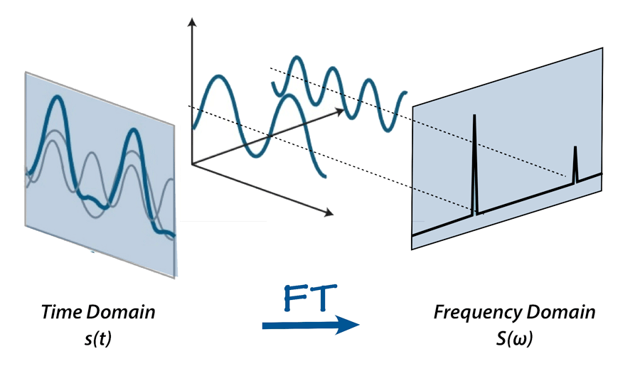
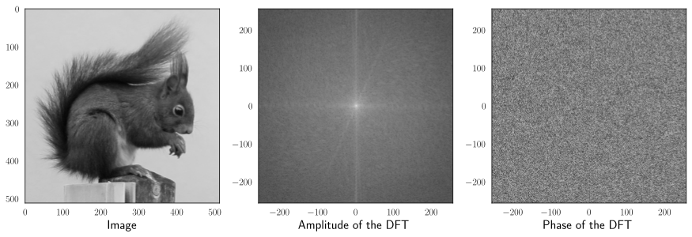
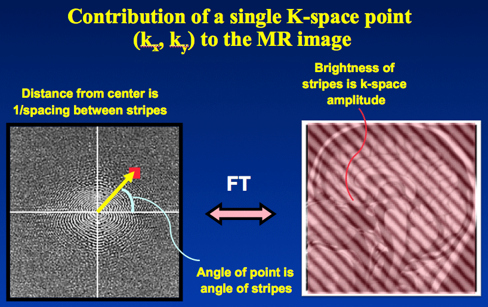
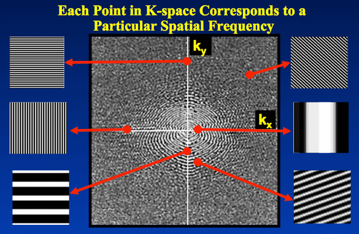
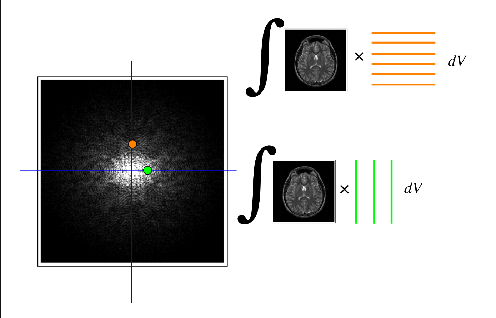
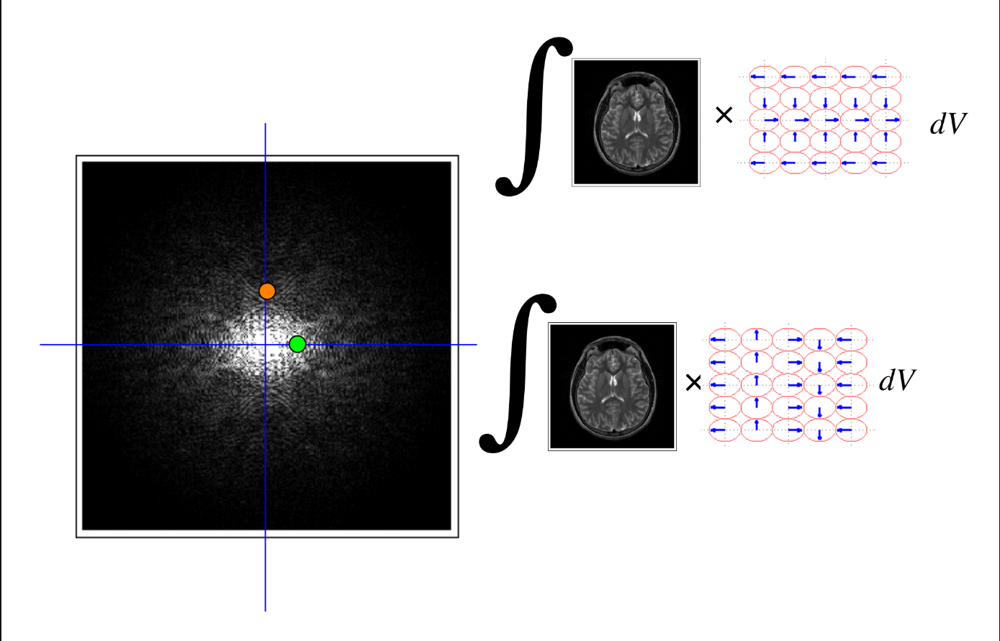

# Imagens no Espaço de Fourier

## Referências

## Introdução

Imagens no domínio espacial eram vistas como funções com domínio definido no $R^2$, onde, para cada coordenada $(x, y)$, havia uma intensidade $f(x, y)$ associada. No contexto da Transformada de Fourier, as imagens passam a ser enxergadas como um sinal que varia no espaço $(x, y)$ e, sendo assim, as mesmas possuem características e comportamentos inerentes de um sinal que varia no tempo ou espaço e podem ser representadas no domínio da frequência sem perda alguma de informação. No entanto, quando aplicamos a Transformada de Fourier a uma imagem, como podemos interpretar e representar a saída obtida? Essa seção busca, justamente, esclarecer essa questão.

No caso da análise de imagens no espaço de Fourier, vale ressaltar que estamos interessados especialmente na Transformada de Fourier Discreta 2D (DFT-2D).

## K-Space

A Transformada de Fourier Bidimensional (FT-2D) implica que imagens podem ser formadas pela combinação linear das várias senoides bidimensionais que as compõe.

Isso pode ser facilmente observado pelas seguintes demonstrações:

* [Demonstration of the 2D Fourier Transform](https://www.youtube.com/watch?v=0mHRJ_42800)
* [2D Fourier Transform - An Example](https://www.youtube.com/watch?v=js4bLBYtJwY)

### Senoides Bidimensionais

Senoides com domínio definido no $R²$ podem ser definidas da seguinte forma:

$f(x, y) = Asen(k_{x}x + k_{y}y + \phi)$

* A: amplitude 
* $\phi$: fase (deslocamento da onda ao longo do eixo $x$ e $y$)
* $k_{x} e k_{y}$: constantes de frequência da onda

As constantes $k_{x}$ e $k_{y}$ determinam a direção de propagação da onda no plano $xy$.

* Para $k_{x} = 0$ e $k_{y} \neq 0$ a onda se propaga na direção do eixo $y$.
* Para $k_{x} \neq 0$ e $k_{y} = 0$ a onda se propaga na direção do eixo $x$.
* Para $k_{x} = k_{y}$ a onda se propaga na direção $x = y$ ($45^{o}$).

Além disso, a magnitude do vetor $k = k_{x} + k_{y}$ indica a frequência da onda.

Confira a demonstração de como uma senóide bidimensional se propaga na superfície: [Two-dimensional plane wave visualisation](https://www.youtube.com/watch?v=C2k-SEdiihs)

### FT-1D 

Quando a Transformada de Fourier é aplicada a um sinal que se propaga em apenas uma dimensão, como o tempo, por exemplo, é facil visualizar e associar a saída obtida com o sinal em questão. Nesse cenário, podemos definir:

$F(\mu) = \int_{-{\infty}}^{\infty} f(t) . e^{-j2{\pi}{\mu}t} dt$

Ou seja, a função $F(\mu)$ decompõe o sinal em uma soma (integral) de senóides de diferentes frequências, cada uma com amplitude e fase específicas, permitindo entender como o sinal esta distribuído entre as várias frequências. Assim, para cada frequência $\mu$ há um número complexo $F(\mu)$ associado, o qual armazena tanto a informação da amplitude, quanto da fase, da senóide associada a essa frequência.

$F(\mu) = A(\mu) . e^{j{\theta}(\mu)}$

* A: amplitude da frequência $\mu$
* $\theta$: fase, ou deslocamento, da frequência $\mu$

Dessa forma, a amplitude pode ser calculada pela magnitude do vetor associado ao número complexo $F(\mu)$ e sua fase pela rotação desse vetor no plano complexo (ângulo formado entre o vetor e o eixo real).

$A = |F(\mu)| = \sqrt{{Re\{F(\mu)\}}^{2} + {jIm\{F(\mu)\}}^{2}}$

$\theta = arctan(\frac{jIm\{F(\mu)\}}{Re\{F(\mu)\}})$

    

### FT-2D e K-Space

O entendimento da saída produzida pela Transformada de Fourier unidimensional pode ser estendido para a Transformada de Fourier Bidimensional, e é nesse momento que o K-Space revela-se importante.

Primeiro ponto a ser observado é que não existe uma relação direta entre uma imagem e sua representação no k-Space. Todos os pontos no K-Space influenciam no valor final de um determinado pixel pertencente a imagem associada.

No caso da FT-2D podemos definir:

$F({\mu}, {\nu}) = \int_{-{\infty}}^{\infty} \int_{-{\infty}}^{\infty} f(x, y) . e^{-j2{\pi}({\mu}x + {\nu}y)} dxdy$

    

Dessa forma, as variáveis ${\mu}$ e ${\nu}$ no K-Space correspondem as frequências horizontais e verticais, respectivamente, e, para cada coordenada $({\mu}, {\nu})$ há um número complexo $F({\mu}, {\nu})$ que armazena a amplitude e fase dessa frequência em específico. De forma grosseira, pode-se dizer que cada ponto $({\mu}, {\nu})$ no K-Space representa uma frequência específica que pode compor a imagem.

Vale ressaltar que as representações de Transformadas de Fourier de imagens, geralmente, mostram apenas a magnitude dos vetores (os quais representam os números complexos de saída da função) associados a cada frequência. Isso se deve a dificuldade de representar números complexos no $R^{3}$. No entanto, a fase associada a cada frequência desempenha papel tão importante quanto para descrever as senóides que compõe o sinal. Sendo assim, para aplicar a Transformada de Fourier inversa, e reconstruir a imagem original, ambas informações devem ser preservadas.

    
    
   

    
    

## Propriedades da Transformada de Fourier (DFT-2D)

$F(u, v) = \sum ._{x=0}^{M-1} \sum ._{y=0}^{N-1} f(x, y) . e^{-j2{\pi}(\frac{ux}{M} + \frac{vy}{N})}$

### Componente DC do Espectro

$F(0, 0)$ é a componente DC do espectro e é dado por:

$F(0, 0) = \sum ._{x=0}^{M-1} \sum ._{y=0}^{N-1} f(x, y)$

A componente DC do espectro é proporcional a intensidade média de uma imagem.

### Conjugado Simétrico

Se $f(x, y)$ é real a FT dessa função é conjugada simétrica, ou seja:

$F(u, v) = F(-u, -v)$

O espectro da FT também é simétrico:

$|F(u, v)| = |F(-u, -v)|$

### Periodicidade

FT-2D é infinitamente periódica nas direções de $u$ e $v$:

$F(u, v) = F(u + k_{1}M, v) = F(u, v + k_{2}N) = F(u + k_{1}M, v + k_{2}N)$

$f(x, y) = f(x + k_{1}M, y) = f(x, y + k_{2}N) = f(x + k_{1}M, y + k_{2}N)$

Isso permite centralizar o componente DC na coordenada $(\frac{M}{2}, \frac{N}{2})$

DFT 2D obtida multiplicando-se $f(x, y)$ por ${(-1)}^{x + y}$ antes de calcular $F(u, v)$. A FT aplicada nesse produto resulta em $F(u - \frac{M}{2}, v - \frac{N}{2})$.

### Teorema da Convolução

A convolução espacial discreta de duas funções $f(x, y)$ e $h(x, y)$ é dado por:

$f(x, y) * h(x, y) = \sum ._{m=0}^{M-1} \sum ._{n=0}^{N-1} f(m, n) . h(x - m, y - n)$

O Teorema da Convolução diz que a DFT inversa do produto $F(u, v) . H(u, v)$ resulta em $f(x, y) * h(x, y)$ (convolução espacial 2D de f e h). Ou seja, as axpressões formam um par de transformações de Fourier.

$f(x, y) * h(x, y) <-> F(u, v) . H(u, v)$

### Análise do Espaço de Fourier

O centro do centro da transformada de Fourier, região próxima da origem, agrupa as senódeis de frequências mais baixas. Essas frequências estão associadas aos componentes de variação lenta de intensidade em uma imagem e, geralmente, possuem valores altos de magnitude, tendo em vista que são elas as principais contribuidoras da composição da imagem.

Já as regiões mais afastadas do centro da transformada, agrupam as senódeis de frequências mais altas. Responsáveis por renderizar bordas de ojetos e contribuir com maior nível de detalhamento, essas frequências estão associadas à variações abruptas de intensidade em uma imagem e tendem a possuir valores inferiores de magnitude.

Vale ressaltar que essa associação entre frequência e magnitude é uma generalização grosseira e que cada imagem possui suas peculiaridades.