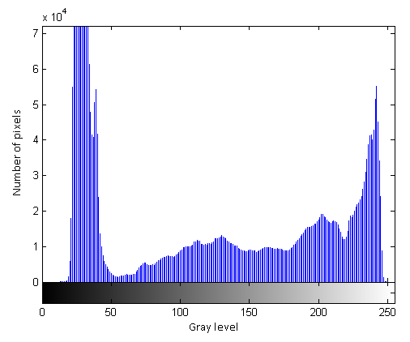

# Processamento de Histogramas

Histograma de uma imagem digital pode ser visto como uma função de distribuição de probabilidade que fornece uma descrição global da mesma.

$p(r_k)$ determina a probabilidade de ocorrência do nível de cinza $r_k$ na imagem.

&nbsp;&nbsp;&nbsp;&nbsp; $p(r_k) = {{n_k} \over NM}$

, onde $n_k$ é a frequência absoluta de pixels com intensidade $r_k$ de uma imagem $M$ x $N$. 

    

A ideia por trás das técnicas de processamento de histogramas é aplicar, de forma automática, funções de transformação de intensidade baseado nas informações extraídas no histograma da imagem.

As funções baseadas em histogramas podem ser globais ou locais:

* [Equalização de Histogramas](equalizacao)
* [Especificação de Histogramas](especificacao)
* [Realce Local]()

