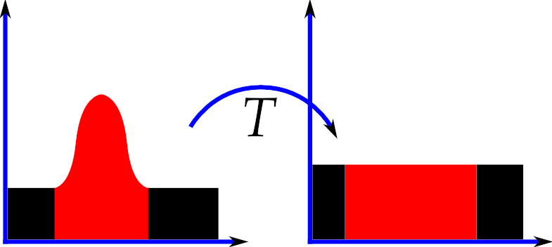

# Equalização de Histogramas

Transformação global dos níveis de cinza de uma imagem que visa aumentar o intervalo dinâmico das intensidades, melhorando o seu contraste.

A ideia é que a imagem resultante possua uma distribuição mais uniforme dos seus níveis de cinza.

## Definição matemática

A dedução da fórmula da função de transformação $T(r)$ responsável pela equalização do histograma se baseia em duas funções de densidade de probabilidade (FDP): $p_r(r)$ e $p_s(s)$. 

Tais funções são, respectivamente, as FDP da imagem original, função arbitrária, e da imagem resultante, que, idealmente, possui um formato uniforme. 

    

Sendo assim, baseado na teoria da probabilidade, podemos relacionar ambas FDP pela derivada de uma em relação a outra:

&nbsp;&nbsp;&nbsp;&nbsp; $p_s(s) = p_r(r) \vert { \frac{\mathrm{dr}}{\mathrm{d}s}} \vert$

Pela função de distribuição cumulativa podemos definir:

&nbsp;&nbsp;&nbsp;&nbsp; $s = T(r) = (L - 1) \left(\int_{0}^{r} \ p_r(w)\ dw \right)$

, onde $[0, L - 1]$ é o intervalo fechado de intensidades possíveis.

Como os níveis de intensidade de uma imagem são valores inteiros, a forma discreta da fórmula acima pode ser definida como um somatório:

&nbsp;&nbsp;&nbsp;&nbsp; $s_k = T(r_k) = (L - 1) \ \sum_{j=0}^k \ \left(p_r(r_j) \right)$

, para $k$ = 0, 1, 2, ... , $L - 1$

Vale ressaltar que $p_s(s)$ não será uniforme devido a discretização dos valores de intensidade, que exige certos arredondamentos.