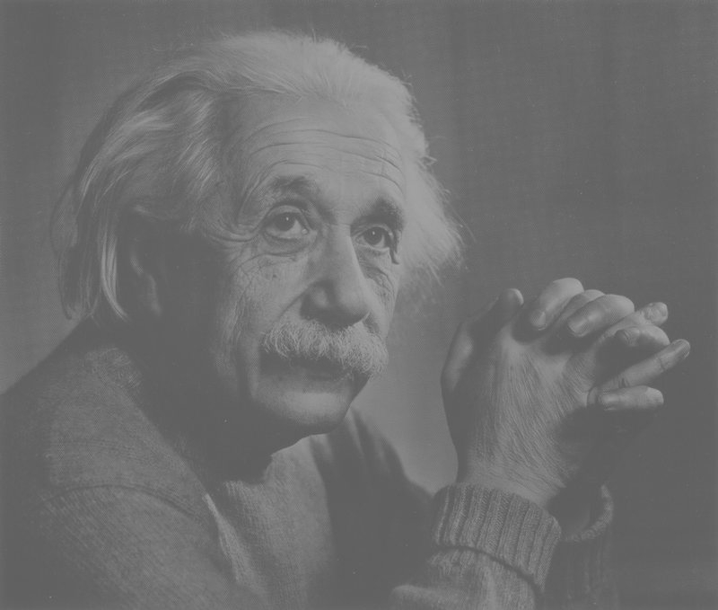
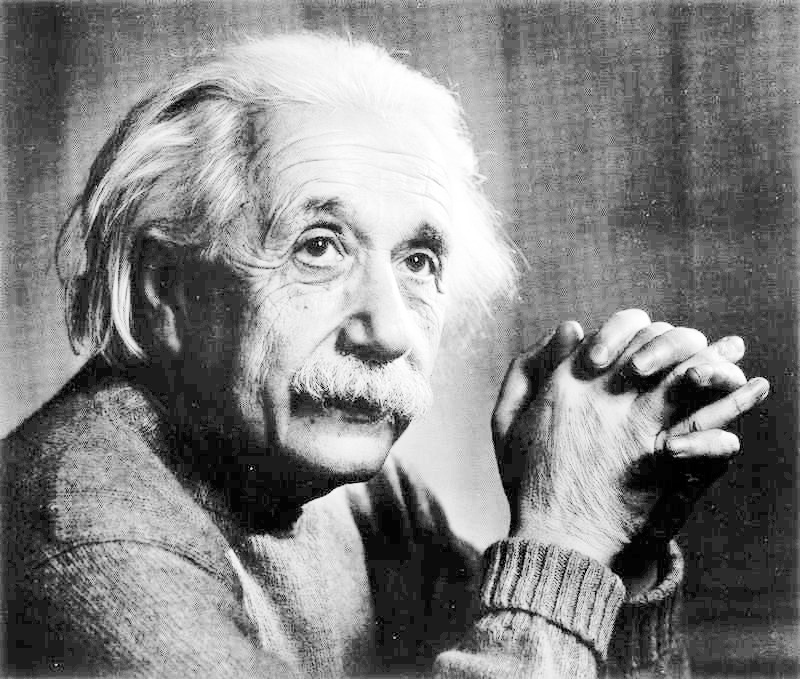
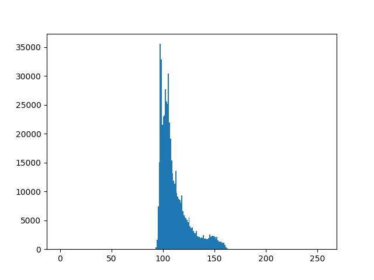
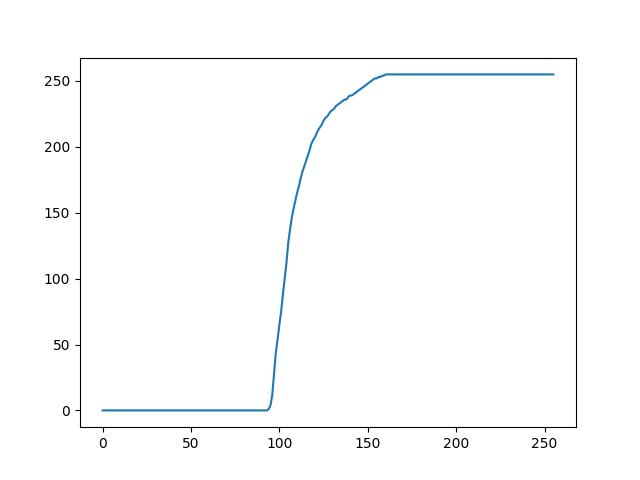
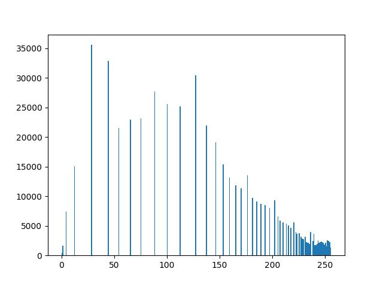

# Exemplo de Equalização de Histograma: Einsten

Observe que a imagem de saída aparenta possuir cores mais vibrantes e detalhes mais visíveis, tudo isso em função da melhor distribuição dos níveis de cinza. 

    
    

Isso pode ser visto comparando o histograma de ambas imagens e a função de transformação gerada pelo algoritmo:

    
    
    

## Detalhes da implementação

Veja a implementação do algoritmo responsável por aplicar a [equalização do histograma](equalizacao.py) nesse exemplo.

Inicialmente, o histograma da imagem de entrada foi calculado. Para isso, um array de 256 posições (8 bits de intensidade) foi criado para contabilizar o número de vezes que cada intensidade foi registrada na imagem. Assim, cada pixel da imagem foi percorrido e sua respectiva intensidade foi incrementada. Como a função de probabilidade deve ser normalizada, ao final da contagem os elementos do array foram divididos pelo número total de pixels.

Após isso, foi criado um segundo array para representar a função de transformação que foi aplicada a cada pixel da imagem de entrada. Assim, foi utilizada a versão discreta da fórmula matemática definida anteriormente, que contou com o arredondamento dos valores de intensidade de saída.

Por fim, os valores de intensidade da imagem de entrada foram substituídos pelos seus respectivos valores apontados pela função de transformação calculada.