# Fatiamento de Bits

Técnica útil para compressão de imagens.

Permite analisar a importância relativa de cada bit na imagem e definir o número adequado de bits para quantizá-la.

    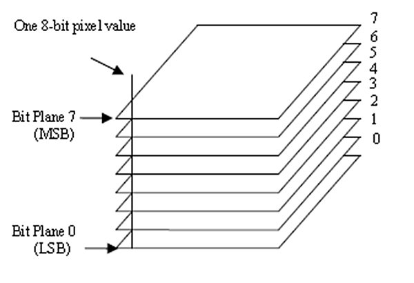
    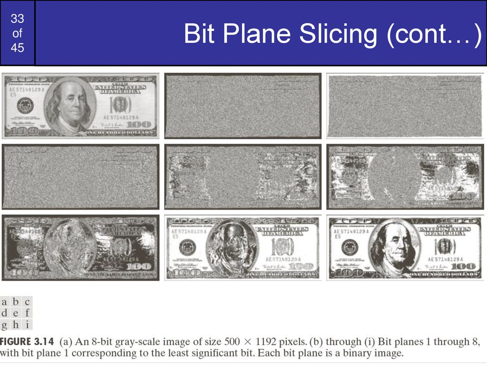

Veja a implementação do [algoritmo de fatiamento de bits](fatiamentoBits.py), em que a imagem é dividida em cada um de seus planos componentes e, posteriormente, os bits mais significativos são somados visando a reconstrução da imagem.

## Detalhes da Implementação

As imagens representam, em ordem de maior significância, cada um dos planos que compõe a imagem.

Cada plano pode ser representado individualmente como uma imagem binária (assume apenas 0 ou 1 como níveis de intensidade).

    
    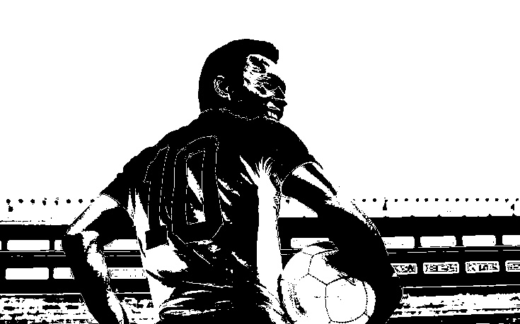
    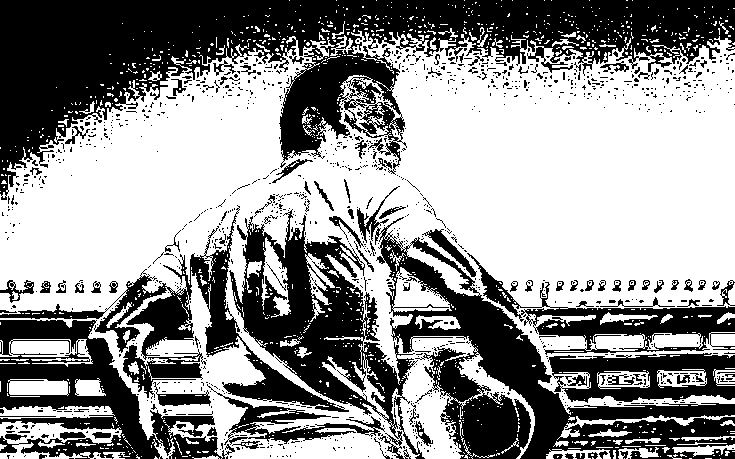
    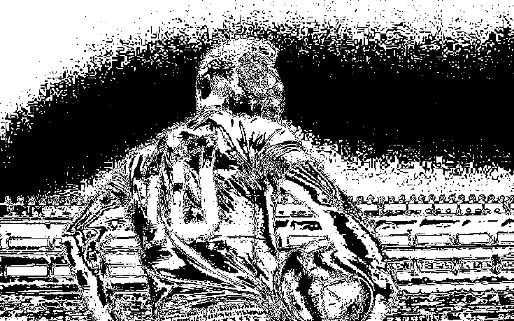

    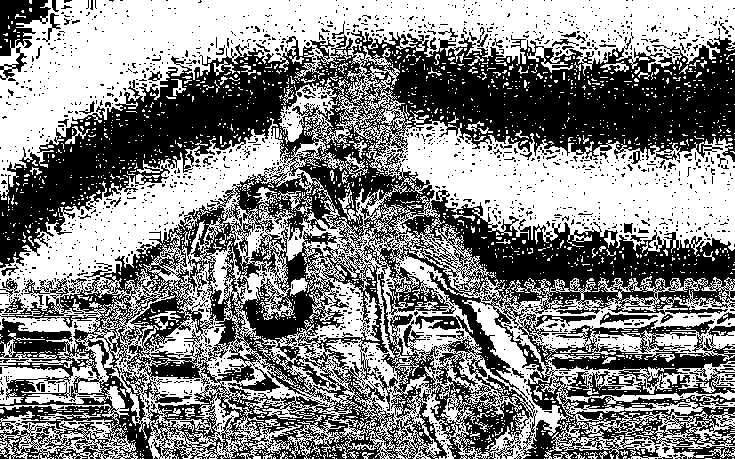
    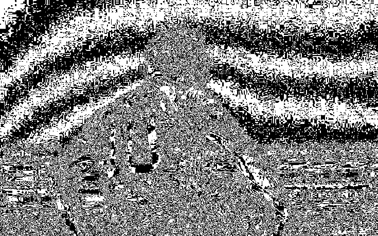
    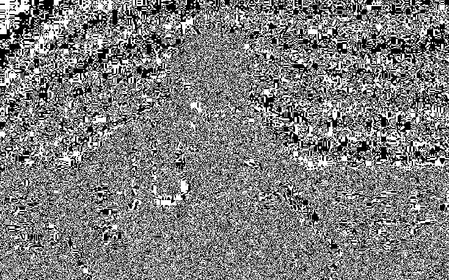
    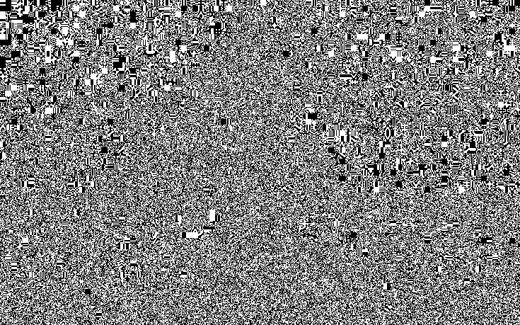

Geralmente, os bits mais significativos guardam as informações mais importantes para a composição da imagem e, portanto, são selecionados na compressão da mesma. Quanto mais bits forem utilizados, mais o resultado obtido se aproxima da imagem original.

Para a reconstrução da imagem original, os bits removidos são substituídos pelo valor zero. Sendo assim, para o cálculo da intensidade de cada pixel, basta realizar o somatório de cada bit selecionado multiplicado por $2^n$, onde $n$ representa o n-ésimo plano da imagem, que se encontra ocupado pelo bit em questão.

Na sequência mostrada abaixo, a cada imagem um bit menos significativo é removido de sua representação. A primeira imagem contêm os 8 planos que a compõe e a última apenas o plano do bit mais significativo. 

Observe que mesmo utilizando-se apenas 4 bits para representar os níveis de intensidade de cada pixel a imagem manteve consideravelmente sua integridade. Isso representa uma redução pela metade do tamanho ocupado pela imagem, valor esse significativamente relevante para o processo de transferência de dados pela internet.

    
    
    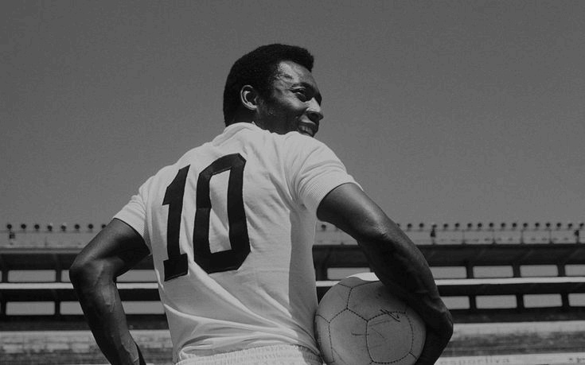
    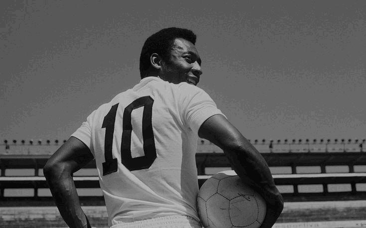

    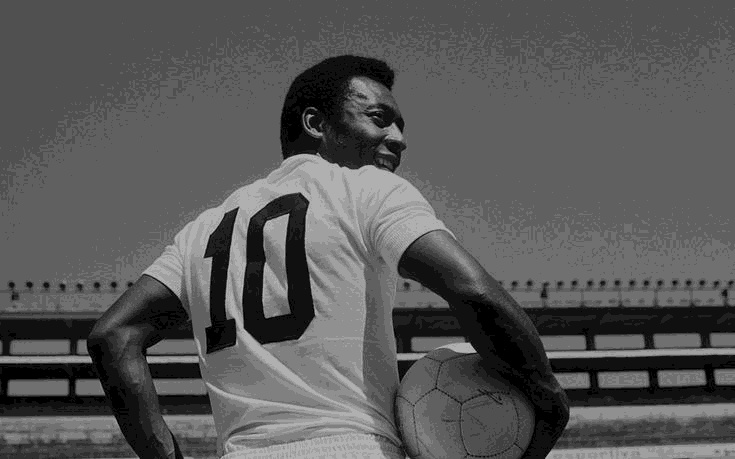
    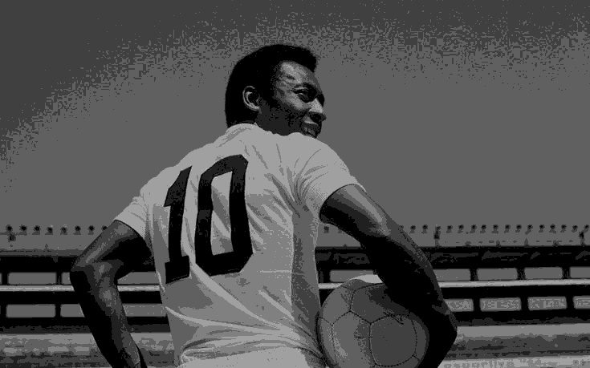
    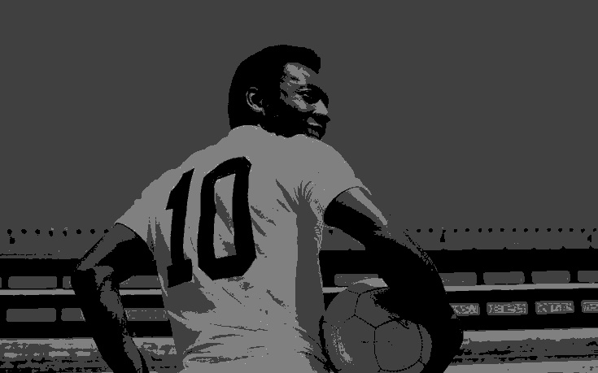
    

## Esteganografia em imagens digitais

Fato curioso, é o uso dessa análise da importância dos bits que compõe os planos de uma imagem para desenvolver técnicas de esteganografia em imagens digitais. 

Como os bits menos significativos tendem a não influenciar de forma relevante a coloração de uma imagem, eles podem ser utilizados para ocultar informações.

    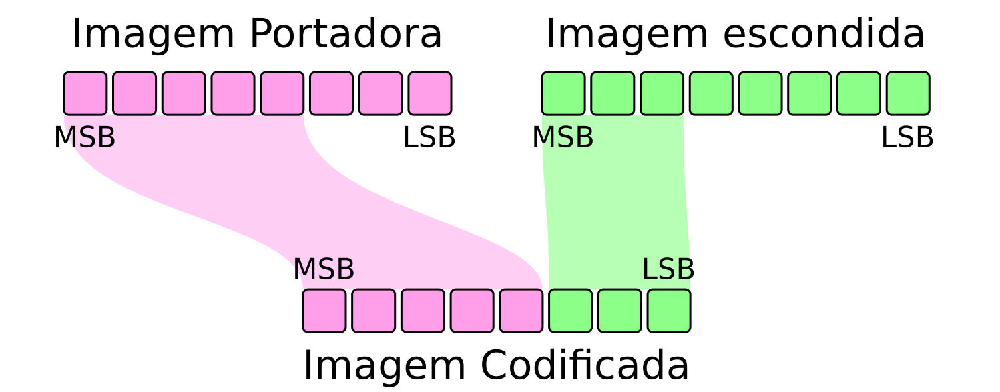

