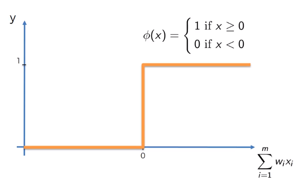

# Transformação Linear Definida por Partes

Transformação Linear Definida por Partes permite definir a forma da função de intensidade de maneira arbitrariamente complexa.

Largamente aplicada para alongamento de contraste e limiarização.

## Alongamento de Contraste

Utilizado para aumentar o intervalo dos níveis de cinza da imagem sendo processada.

Podemos definir, por exemplo, dois pontos $(r_1, s_1)$ e $(r_2, s_2)$ que vão definir a forma da função de intensidade. Nesse caso, a função passa a ser definida por 3 funções afins, cada qual com determinado coeficiente de angulação.

Vale ressaltar a importância da seguinte condição ser satisfeita visando respeitar a ordem dos níveis de cinza:

$r_1 \leq r_2$ e $s_1 \leq s_2$

Para funções mais complexas, mais parâmetros devem ser definidos.

    
    

Veja um exemplo em que a técnica de [alargamento de contraste](alongamentoContraste) foi aplicada para melhorar a visibilidade de uma imagem.

    
    

## Limiarização

Converge uma imagem em escala de cinza em uma imagem binária.

Pixels com intensidade acima de um determinado limiar são definidos como 1 (branco) e aqueles com intensidade inferior como 0 (preto).

Facilmente implementada como uma função linear definida por partes: basta que $r_1 = r_2 = L$, onde L é o valor definido como limiar da função, além disso, $s_1 = 0$ e $s_2 = 255$.

    

Veja um exemplo em que a técnica de [limiarização](limiarizacao) foi aplicada em uma imagem.

    
    

