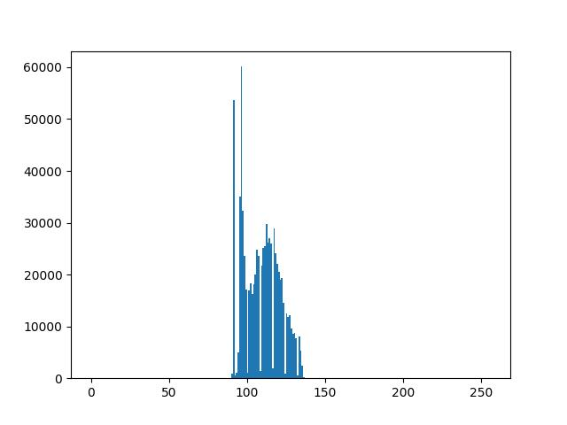
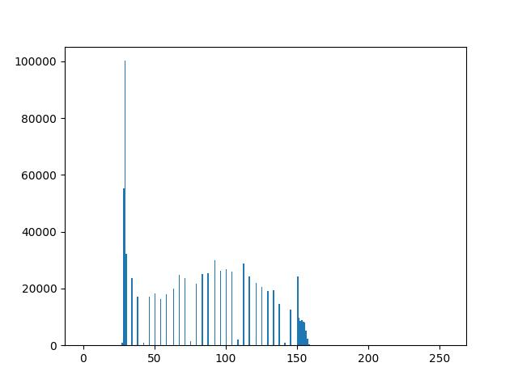
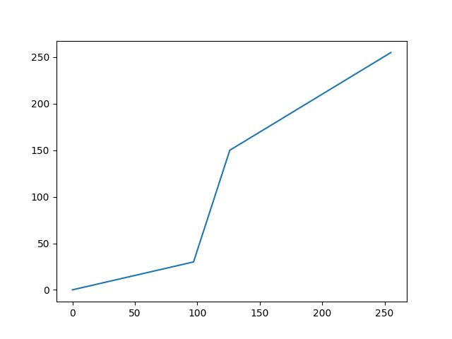

# Alongamento de Contraste

Observe que a imagem de saída possui muito mais detalhes vísiveis e nitidez.

Isso ocorre justamente porque a mesma utiliza um intervalo maior do espectro de intensidade para representar seus pixels.

Essa comparação se torna clara se compararmos os histogramas gerados por ambas imagens.

    
    

    
    
    

## Detalhes da Implementação

Veja a implementação do [algoritmo](alongamentoContraste.py) criado para aplicar o alongamento de contraste.

Verifique que foram definidas 3 funções afins, cada uma com um determinado coeficiente angular, para compor a função de transformação de intensidade. Cada função foi utilizada em um intervalo específico da faixa de valores de intensidade possíveis (nesse caso 0 - 255, visto que a imagem de entrada possui 8 bits por pixel).

Os parâmetro de entrada são justamente dois pontos no plano cartesiano $(r1, s1)$ e $(r2, s2)$, onde as funções afins se interceptam uma a uma. A escolha dos pontos é um fator importante para o funcionamento correto do algoritmo.

Nesse caso, os valores de $r1$ e $r2$ são as extremidades do intervalo em que os pixels da imagem de entrada mais se concentram. Os valores de $s1$ e $s2$ foram escolhidos de forma a obter uma reta que amplie a distribuição dessas intensidades em uma faixa mais extensa de valores, sendo, dessa forma, testados até se obter resultados satisfatórios.