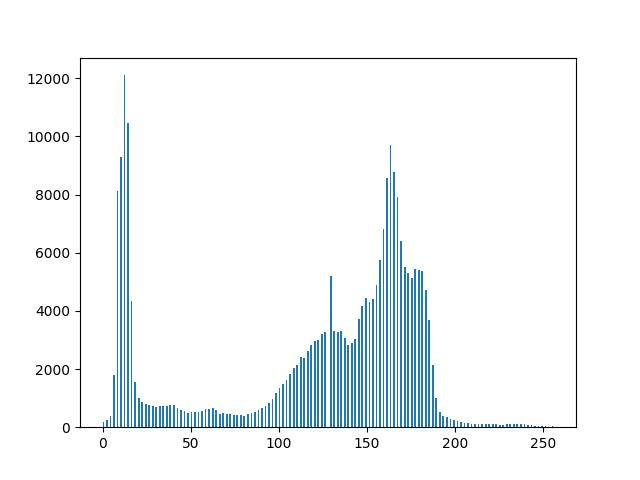
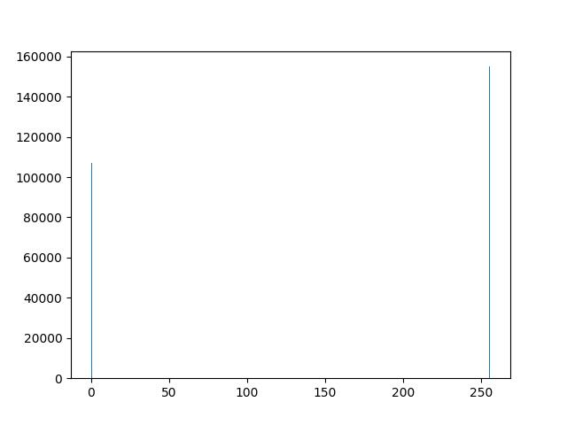

# Limiarização

    
    

    
    

## Detalhes da Implementação

Veja a implementação do [algoritmo](limiarizacao.py) responsável por aplicar a limiarização nesse exemplo.

Um valor foi definido como o limiar da função, nesse caso, 128.

A imagem de entrada é percorrida e, então, para cada pixel é feita a comparação se sua intensiade é superior ao limiar definido. Em caso afirmativo, seu valor passa a ser 255 e, em caso negativo, 0.

