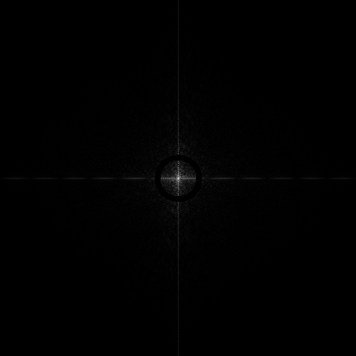
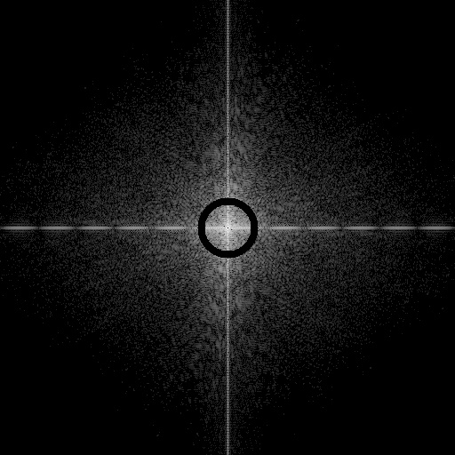
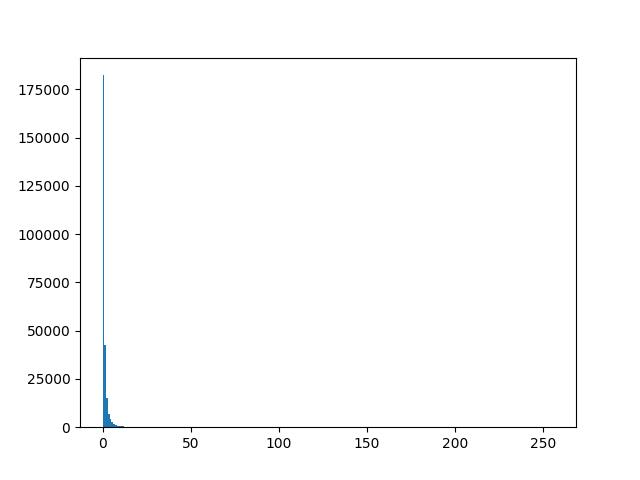
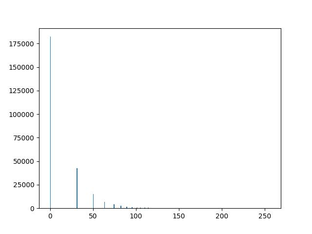

# Transformação Logarítmica

Utilizado para expandir valores baixos de intensidade e comprimir valores altos.

Possui forma geral: $s(r) = c\log(1 + r)$, onde $c$ é uma constante.

    

    
    

## Detalhes da implementação

Veja a implementação do [algoritmo]() responsável por clarear o Espectro de Fourier exibido em uma imagem.

O valor da constante $c$, nesse caso, foi definido como ${255} \over {\log(1 + r)}$, onde $r$ é o valor do pixel maior intensidade presente na imagem.

    
    

