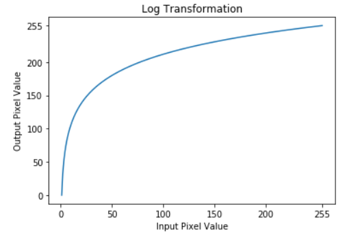

# Transformação Logarítmica

Utilizado para expandir valores baixos de intensidade e comprimir valores altos.

Possui forma geral: $s(r) = c\log(1 + r)$, onde $c$ é uma constante (normalmente $c = 1$).

    

## Detalhes da implementação

Veja a implementação do [algoritmo]() responsável por clarear o Espectro de Fourier exibido em uma imagem.
