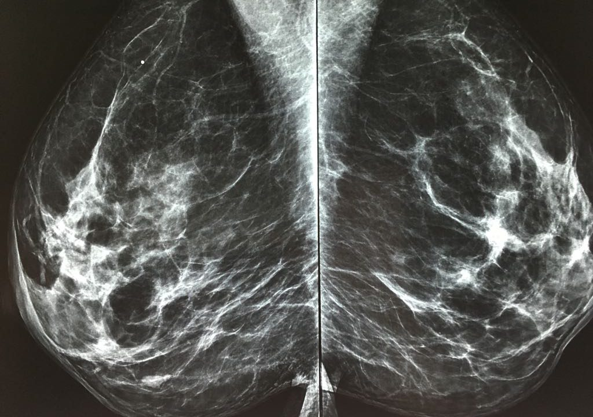
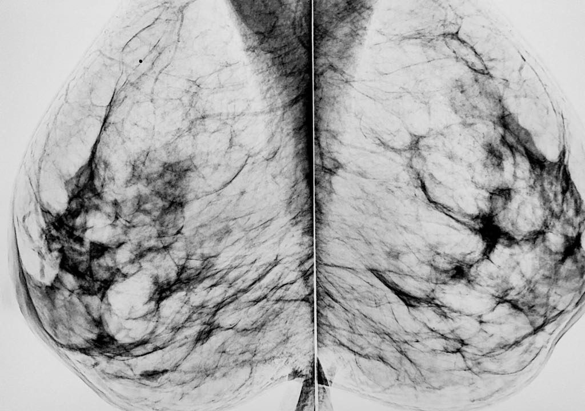
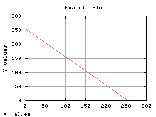
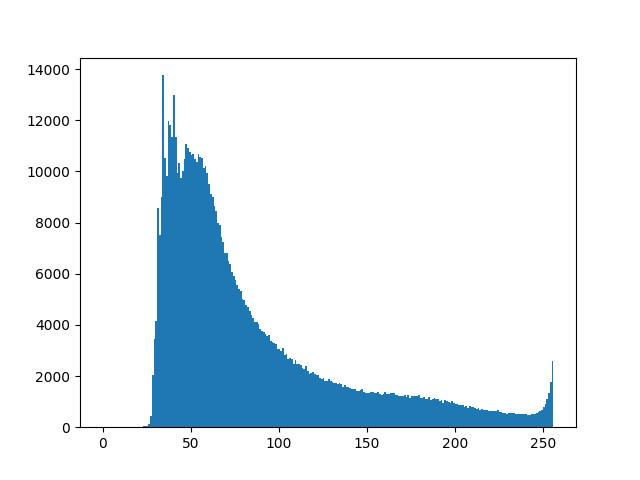
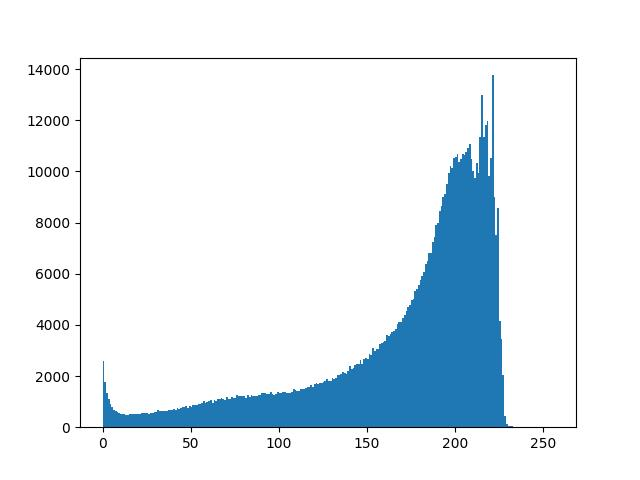

# Negativo de Imagens

Utilizado para realçar detalhes em brancos ou cinzas cercados de regiões escuras dominantes em uma imagem.

Observe que o olho humano é mais sensível para detectar detalhes brancos em regiões escuras.

    
    

É a função inversa da identidade.

    

## Detalhes da implementação

Veja a implementação do [algoritmo](negativo.py) responsável por criar o negativo de um exame de mamografia.

Para inverter a escala de cinza da imagem a seguinte função é utilizada:

$s(r) = 255 - r$

Essa transformação converterá pixels claros em escuros e pixels escuros em claros.

    
    

